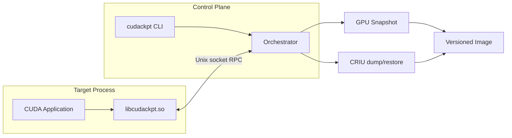

# cudackpt

[](https://github.com/DDVHegde100/cudackpt/actions/workflows/ci.yml)
[](https://github.com/DDVHegde100/cudackpt/releases)
[](https://go.dev/)
[](https://developer.nvidia.com/cuda-toolkit)

**Checkpoint and restore single-GPU CUDA processes on Linux** — without modifying your application.

cudackpt intercepts the CUDA Driver API through an `LD_PRELOAD` shim, snapshots device memory and stream state, coordinates with [CRIU](https://criu.org/) for CPU/process state, and restores execution from a versioned on-disk image.

> **Status:** v0.3.0 — early release. Validate on your stack before production use. See [Limitations](#limitations).

## Features

- **Transparent interception** — `LD_PRELOAD` shim; no app source changes
- **Full-stack checkpoint** — GPU allocations, streams, modules, and process state via CRIU
- **Versioned images** — manifest with CRC32C, optional compression, sparse pages, dedup, and delta snapshots
- **Production tooling** — rollback, image retention GC, promote-image, restore event logs, Prometheus metrics
- **Operator-friendly CLI** — checkpoint, restore, inspect, validate, report, and granular RPC controls

## Quick start

```bash
git clone https://github.com/DDVHegde100/cudackpt.git
cd cudackpt
make
sudo make install
```

Run your CUDA app under the shim, then checkpoint from another terminal:

```bash
export LD_PRELOAD=/usr/lib/libcudackpt.so
./your_cuda_app

cudackpt ps -v
cudackpt checkpoint <pid> /var/lib/cudackpt/run-1
kill <pid>
cudackpt restore /var/lib/cudackpt/run-1
```

Install the `.deb` from [Releases](https://github.com/DDVHegde100/cudackpt/releases) on Ubuntu/Debian, or build from source above.

## Architecture



Checkpoint sequence:

1. Freeze tracked CUDA streams via RPC.
2. Copy live device allocations to host (`device.bin`) with per-chunk CRC32C.
3. Write manifest, device metadata, and environment into a versioned image directory.
4. Invoke CRIU to capture process memory, file descriptors, and registers.

Restore reverses the order: CRIU restore → GPU memory remap at original virtual addresses → resume signal to the application.

## Requirements

| Component | Version |
|-----------|---------|
| OS | Linux x86_64 |
| NVIDIA driver | CUDA 12.x compatible |
| CUDA toolkit | 12.x (`nvcc`, `cmake`) |
| Go | 1.22+ |
| CRIU | 3.x with `criu check` passing |
| Privileges | `sudo` for CRIU and `/run/cudackpt` socket directory |

Optional: Docker with NVIDIA Container Toolkit for containerized e2e; self-hosted GitHub Actions runner with GPU for full e2e CI.

## Installation

```bash
git clone https://github.com/DDVHegde100/cudackpt.git
cd cudackpt
./scripts/install-hooks.sh   # optional: local commit hooks
make
sudo make install DESTDIR=
```

Installed artifacts:

| Path | Role |
|------|------|
| `/usr/lib/libcudackpt.so` | LD_PRELOAD shim |
| `/usr/bin/cudackpt` | Control CLI and orchestrator |

Systemd units and agent daemon: `sudo make install-systemd` (see [docs/OPERATIONS.md](docs/OPERATIONS.md)).

## Usage

Run a CUDA application under the shim:

```bash
export LD_PRELOAD=/path/to/build/libcudackpt.so
./your_cuda_app
```

In another terminal:

```bash
cudackpt ps -v
cudackpt checkpoint <pid> /var/lib/cudackpt/run-1
cudackpt validate /var/lib/cudackpt/run-1
cudackpt inspect /var/lib/cudackpt/run-1
cudackpt report /var/lib/cudackpt/run-1
kill <pid>
cudackpt restore /var/lib/cudackpt/run-1
```

Granular RPC controls:

```bash
cudackpt freeze <pid>
cudackpt snapshot <pid> /tmp/image
cudackpt gpu-restore <pid> /tmp/image
cudackpt resume <pid>
cudackpt status <pid>
```

See [docs/CLI.md](docs/CLI.md) for the complete command reference.

## Testing

```bash
make test
go test ./...
./scripts/run_shim_smoke.sh
sudo scripts/check_env.sh
sudo make checkpoint
sudo make e2e-fast
sudo make all-tests
```

Docker e2e (requires GPU passthrough):

```bash
./scripts/run_docker_e2e.sh
```

Diagnostics on failure:

```bash
./scripts/diag.sh /tmp/cudackpt-e2e
```

Enable shim debug logging:

```bash
export CUDACKPT_DEBUG=1
```

## Image layout

| File | Purpose |
|------|---------|
| `manifest.bin` | Versioned header and chunk index (ptr, size, offset, seq, CRC32C) |
| `device.bin` | Concatenated device memory pages |
| `dev.bin` | GPU device index |
| `meta.bin` | PID, device, LD_PRELOAD, CUDA_VISIBLE_DEVICES |
| `criu/` | CRIU process image |
| `snapshot.err` | Snapshot failure diagnostics |
| `restore.err` | GPU restore failure diagnostics |

## Documentation

- [CLI reference](docs/CLI.md) — all commands and flags
- [Configuration reference](docs/CONFIG.md) — `cudackpt.conf` keys and env vars
- [Operations guide](docs/OPERATIONS.md) — retention, restore, rollback, agent, metrics
- [Self-hosted GPU runner](docs/RUNNER.md) — enable full e2e CI and release gate
- [Changelog](CHANGELOG.md) — release history
- [Contributing](CONTRIBUTING.md) · [Security](SECURITY.md)
- [Examples](examples/vectoradd-checkpoint/README.md) — vectoradd checkpoint walkthrough

## Limitations

- Single GPU only; multi-GPU, MIG, NCCL, and CUDA graphs are rejected.
- GPU restore relies on deterministic reallocation or fixed virtual-address remap; bit-exact resume is workload-dependent.
- CRIU plus CUDA is experimental; validate on your stack before production use.

## License

Proprietary — all rights reserved. See [LICENSE](LICENSE) for terms and licensing inquiries.
