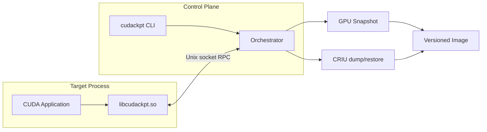

# cudackpt

Single-GPU CUDA process checkpoint and restore for Linux. cudackpt intercepts the CUDA Driver API through an `LD_PRELOAD` shim, snapshots device memory and stream state, coordinates with CRIU for CPU/process state, and restores execution without modifying the target application.

## Architecture



Checkpoint sequence:

1. Freeze tracked CUDA streams via RPC.
2. Copy live device allocations to host (`device.bin`) with per-chunk CRC32C.
3. Write manifest, device metadata, and environment into a versioned image directory.
4. Invoke CRIU to capture process memory, file descriptors, and registers.

Restore reverses the order: CRIU restore, GPU memory remap at original virtual addresses, resume signal to the application.

## Requirements

- Linux (x86_64)
- NVIDIA GPU with CUDA 12.x driver
- CUDA 12.x toolkit (`nvcc`, `cmake`)
- Go 1.22+
- CRIU 3.x with `criu check` passing
- `sudo` for CRIU and `/run/cudackpt` socket directory

Optional:

- Docker with NVIDIA Container Toolkit for containerized e2e
- Self-hosted GitHub Actions runner with GPU for CI e2e

## Installation

```bash
git clone https://github.com/DDVHegde100/cudackpt.git
cd cudackpt
./scripts/install-hooks.sh
make
sudo make install DESTDIR=
```

Installed artifacts:

- `/usr/lib/libcudackpt.so` — LD_PRELOAD shim
- `/usr/bin/cudackpt` — control CLI

## Usage

Run a CUDA application under the shim:

```bash
export LD_PRELOAD=/path/to/build/libcudackpt.so
./your_cuda_app
```

In another terminal:

```bash
cudackpt ps -v
cudackpt checkpoint <pid> /var/lib/cudackpt/run-1
cudackpt validate /var/lib/cudackpt/run-1
cudackpt inspect /var/lib/cudackpt/run-1
cudackpt report /var/lib/cudackpt/run-1
kill <pid>
cudackpt restore /var/lib/cudackpt/run-1
```

Granular RPC controls:

```bash
cudackpt freeze <pid>
cudackpt snapshot <pid> /tmp/image
cudackpt gpu-restore <pid> /tmp/image
cudackpt resume <pid>
cudackpt status <pid>
```

## Testing

```bash
make test
go test ./...
./scripts/run_shim_smoke.sh
sudo scripts/check_env.sh
sudo make checkpoint
sudo make e2e-fast
sudo make all-tests
```

Docker e2e (requires GPU passthrough):

```bash
./scripts/run_docker_e2e.sh
```

Diagnostics on failure:

```bash
./scripts/diag.sh /tmp/cudackpt-e2e
```

Enable shim debug logging:

```bash
export CUDACKPT_DEBUG=1
```

## Image Layout

| File | Purpose |
|------|---------|
| `manifest.bin` | Versioned header and chunk index (ptr, size, offset, seq, CRC32C) |
| `device.bin` | Concatenated device memory pages |
| `dev.bin` | GPU device index |
| `meta.bin` | PID, device, LD_PRELOAD, CUDA_VISIBLE_DEVICES |
| `criu/` | CRIU process image |
| `snapshot.err` | Snapshot failure diagnostics |
| `restore.err` | GPU restore failure diagnostics |

## Limitations

- Single GPU only; multi-GPU, MIG, NCCL, and CUDA graphs are rejected.
- GPU restore relies on deterministic reallocation or fixed virtual-address remap; bit-exact resume is workload-dependent.
- CRIU plus CUDA is experimental; validate on your stack before production use.

See [docs/OPERATIONS.md](docs/OPERATIONS.md) for retention, restore, and rollback procedures.

See [docs/CLI.md](docs/CLI.md) for the complete command reference.

## License

Proprietary. See repository owner for terms.
